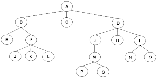
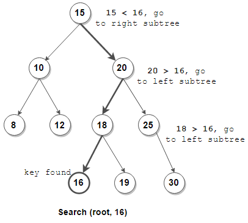
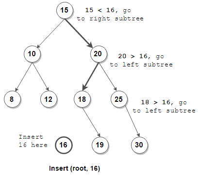
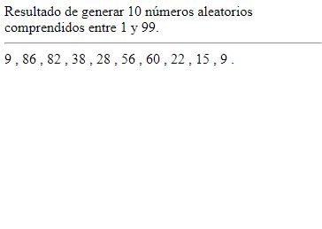

# Laboratorio 10
## Parte Dirigida
---

Una estructura de datos es una forma particular de organizar datos en una computadora para que puedan ser utilizados de manera eficiente. Diferentes tipos de estructuras de datos son adecuados para diferentes tipos de aplicaciones, y algunos son altamente especializados para tareas específicas.

Las estructuras de datos no solo representan la información, también tienen un comportamiento interno, y se rige por ciertas reglas/restricciones dadas por la forma en que está construida internamente. Entre las estructuras de datos más conocidas se encuentran las listas, los stacks y las colas. En este laboratorio trabajaremos con los árboles binarios de búsqueda pero para esto es importante primero saber que es un árbol.

### Árboles

Un árbol es un tipo de grafo en donde existe un número N de nodos o vértices y un total de N - 1 uniones, existiendo un único camino para cada par de vértices del árbol. Este comportamiento se puede evidenciar mejor en la siguiente imagen:

### Nodos

Es la unidad fundamental de la que están formados los árboles y los grafos en general. Para los árboles existen los siguientes tipos de nodos.

* Raíz: El primer nodo de un árbol 
* Padre: Todo nodo que tiene al menos un hijo
* Hijo: Todo nodo que tiene un padre
* Hermano: Nodos con el mismo padre dentro del árbol
* Hoja: Todo nodo que no tiene hijos. Se encuentran en los extremos de la estructura
* Rama: Todos los nodos que no son raíz ni hoja

### Árbol binario de búsqueda

Un árbol binario es un árbol en donde cada nodo solo puede tener 2 nodos como máximo. Un árbol binario de búsqueda es un tipo de árbol binario en donde el hijo izquierdo solamente contiene nodos con valores menores o iguales que el nodo padre, y en donde el hijo derecho solamente contiene nodos con valores mayores al nodo padre. Estos árboles nos permiten realizar operaciones mucho más rápidas que una estructura sencilla sobre la data.

* El `nivel` de un nodo es la longitud del camino desde la raíz hasta el nodo (la raíz tiene nivel 0)
* La `profundidad` de un nodo es sinónimo del `nivel` del nodo
* La `altura` de un nodo es la distancia más larga de ese nodo hacia un nodo hoja (un nodo hoja tiene altura 0). La `altura de un árbol` es la altura del nodo raíz.

### Algoritmo de búsqueda

Para buscar tenemos que colocarnos en la raíz del árbol y verificar si el valor del nodo es el deseado. Si lo es, el algoritmo termina. En caso contrario, continuaremos buscando por la derecha (si es que el valor deseado es mayor al valor del nodo) o por la izquierda (si es que el valor deseado es menor al valor del nodo).

En la siguiente imagen podemos ver un ejemplo de buscar el valor de 16 en un árbol binario de búsqueda.

### Algoritmo de inserción

Todo elemento que insertemos siempre va a hacer un nodo hoja. Se empieza buscando el valor en donde debería ir el nodo usando la misma lógica del algoritmo descrito previamente. Una vez que tengamos que ir hacia algún lugar (izquierda o derecha) pero no exista ningún nodo, tendremos que crear uno nuevo con el valor a insertar. Para la parte práctica no tomaremos en cuenta el caso en el que se intente insertar un valor repetido.

### Algoritmo de eliminación

Para eliminar elementos tenemos que buscar el nodo a eliminar con el algoritmo de búsqueda y controlar los siguientes 3 casos:

* Si es una nodo hoja: Eliminarlo
* Si es un nodo con un hijo: Reemplazarlo con su hijo y eliminarlo
* Si es un nodo con dos hijos: Se busca el siguiente elemento o el anterior (esta decisión es completamente arbitraria) al nodo a eliminar y se reemplaza para eliminarlo, siempre y cuando sea una hoja al reemplazarlo (este proceso puede realizarse varias)

NOTA: Este algoritmo no será evaluado en el laboratorio

### Recorridos de un árbol

Recorrer un árbol significa visitar cada nodo en un orden específico

1. Post-order: Se recorre el hijo izquierdo, luego el hijo derecho y se lee la data.
2. In-order: Se recorre el hijo izquierdo, se lee la data y después se recorre el hijo derecho.
3. Pre-order: Se lee la data, luego se recorre el hijo izquierdo y al final el derecho.

Los recorridos para el siguiente ejemplo son:

* Post-order: 1, 4, 7, 6, 3, 13, 14, 10, 8
* In-order: 1, 3, 4, 6, 7, 8, 10, 13, 14
* Pre-order: 8, 3, 1, 6, 4, 7, 10, 14, 13

## Parte Práctica

Generar 10 números aleatorios enteros, usando como extremo inferior 1 y como extremo superior 100 usando la siguiente herramienta: https://www.ugr.es/~jsalinas/Aleatorios.htm

Guardar una imagen o screenshot con los valores generados.

### Ejercicio 1

Crear un árbol binario de búsqueda insertando los 10 elementos en el orden mostrado y mostrar el árbol resultante.

### Ejercicio 2

Buscar el quinto elemento insertado en el árbol y mostrar el recorrido de los nodos por los que pasaron para encontrar al elemento.

<!--
### Ejercicio 3

Eliminar el séptimo elemento insertado y mostrar el árbol resultante después de la eliminación.
-->

### Ejercicio 3

Mostrar el recorrido Post-order, In-order y Pre-Order del árbol obtenido en el ejercicio 3.

### Entregable

Debe entregar un archivo en canvas `.jpg` o `.jpeg` por pregunta con la solución a cada ejercicio siguiendo el siguiente formato: `ejercicio_x.jpg`, siendo x el número del ejercicio. Además, debe adjuntar una imagen `numeros.jpg` de los números aleatorios arrojados por la página. Puede guiarse de la siguiente imagen.

