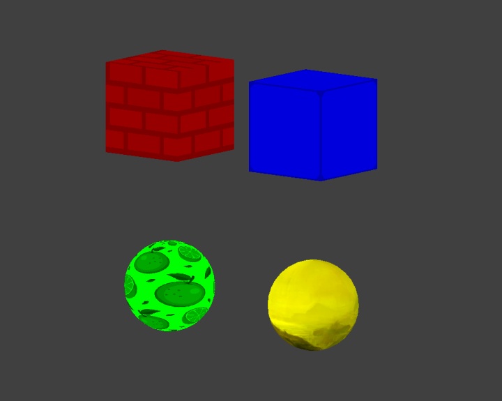

# Laboratorio 11

## Parte Dirigida

---

Es el campo de la informática visual, donde se utilizan computadoras para generar imágenes visuales y espaciales del mundo real.También podemos definirlo como el arte de transmitir información usando imágenes que son generadas mediante la computación.

Este campo puede ser dividido en varias áreas: Interpretado 3D en tiempo real (a menudo usado en juegos de vídeo), animación de computadora, captura de vídeo y creación de vídeo interpretado, edición de efectos especiales (a menudo usado para películas y televisión), edición de imagen, y modelado (a menudo usado para ingeniería y objetivos médicos).

### Ursina Engine

Para este laboratorio, se utilizaremos el motor gráfico de la librería [Ursina Engine](https://www.ursinaengine.org/). Podemos adquirirlo a traves de `pip` con el comando:

```
pip install ursina
```

Una vez instalada la librería, un proyecto de `ursina` tiene la siguiente forma:

```py
from ursina import *

app = Ursina()

# Lógica

app.run()
```

### Dibujar una entidad

Lo que sigue es un ejemplo en el cual se dibuja un [cubo](https://www.ursinaengine.org/cheat_sheet.html#models) de color rojo, en la posición `(0,0,0)` el cual se ha rotado 45° en su eje `x` e `y` y se le ha aplicado la textura `white_cube`.

```py
Entity(model='cube', position=(0,0,0), color=color.red, texture='white_cube', rotation=(45,45,0))
```

La clase entity tambien puede recibir los siguientes parámetros:

- `position`: Recibe una triple tupla con la forma `(x,y,z)`
- `texture`: Recibe el nombre de un archivo de textura (sin extensión), o puede usar una de las [texturas default](https://www.ursinaengine.org/cheat_sheet.html#textures).
- `color`: Recibe un [color](https://www.ursinaengine.org/cheat_sheet.html#color).
- `rotation`: Recibe una triple tupla con los grados de rotación en cada eje.

### Camara

Para agregar una camara de control manual, de modo que se puedan ver los objetos de distintos ángulos, se pueden agregar las siguientes lineas de código:

```py
camera.orthographic = True
EditorCamera()
```

La camara utiliza los siguientes controles:

- `click derecho`: Rota la camara
- `scroll click`: Mueve la camara
- `scroll`: Controla el zoom

### Ejemplo

Juntando todo lo mencionado anteriormente, tenemos el siguiente código, que genera dos cubos y dos esferas utilizando diferentes texturas, incluyendo la textura `fruit` proveniente del archivo `fruit.png`.

```py
from ursina import *

app = Ursina()

camera.orthographic = True

Entity(model='cube', color=color.red, position=(-1,1,0), texture='brick')
Entity(model='cube', color=color.blue, position=(1,1,0), texture='white_cube')
Entity(model='sphere', color=color.yellow, position=(1,-1,0), texture='shore')
Entity(model='sphere', color=color.green, position=(-1,-1,0), texture='fruit')

EditorCamera()

app.run()
```

Y el resultado sería el siguiente:



## Parte Práctica

Utilizando las herramientas explicadas anteriormente, dibujen sus [iniciales](https://i.pinimg.com/564x/bd/b6/cd/bdb6cd9f52015c66fd48ec56a65f6b7e.jpg) a base de entidades, utilizando una textura y color diferente para cada letra. Al menos una textura debe ser una externa a las incluidas con `ursina`.

### Entregable

- El archivo `.py` que permite dibujar sus iniciales.
- Un `screenshot` de su creación.
