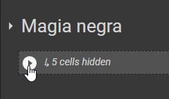

# Laboratorio 12

## Parte Dirigida

---

La Inteligencia Artificial aplicada a la definición de cluster consiste en la segmentación y delimitación de grupos de elementos, generalmente representados en forma de datos, que pueden ser unidos por características o patrones comunes que comparten.

Esta asociación es realizada mediante la aplicación de clustering, o lo que es lo mismo: algoritmos de agrupamiento que analizan el valor del conjunto de los datos y recalculan una y otra vez la estructura del grupo en base al análisis de los elementos que se incluyen dentro de ellos mismos y la media de los valores que lo conforman.

### K-Means

K means (K medias en castellano), es el nombre que recibe la metodología que clasifica los elementos y el centroide con el fin de conformar el cluster.

Su funcionamiento, como ya se ha anticipado anteriormente, consiste en la implantación de los elementos que denominaremos k o centroides dentro de un conjunto de datos, los mismos que se estarán reubicando iterativamente hasta encontrar su punto de equilibrio.

Un centroide será, una vez completada la definición del cluster, el valor medio que conformará el grupo.

Hasta que no se haya alcanzado ese equilibrio, el centroide irá desplazándose a lo largo de la tabla, buscando posiciones cuyos valores medios respecto a los elementos asociados, le permitan ser más estable tanto a él como a los demás centroides.

Por hacer una analogía con el mundo real, imaginemos que nos sueltan de manera aleatoria en un punto indeterminado de la “provincia A” y sabemos que nuestro destino es el centro de la capital. Para llegar allí, podemos mirar un mapa, pero no desplazarnos mientras lo observamos.

Echamos un ojo al mapa, lo cerramos y andamos. Volvemos a mirarlo y comprobamos que estamos más cerca “del punto de equilibrio” que es nuestro destino, por lo que seguimos en esa dirección. De lo contrario, rectificaremos y andaremos en otro sentido.

Fuente: [Avansis](https://www.avansis.es/inteligencia-artificial/que-significa-clustering-y-k-means-en-inteligencia-artificial/)

### Matriz de Confusión

Una matriz de confusión es una herramienta que ayuda a resumir los resultados de un modelo de clasificación.
Por ejemplo, digamos que tenemos un modelo que busca identificar si la imagen muestra a un hombre o una mujer; se tenían 100 datos, 50 hombres, de los cuales se clasificaron correctamente 47, y 50 mujeres, de las cuales se clasificaron correctamente 48. La matriz sería la siguiente:

|         | Hombres | Mujeres |
| ------- | ------- | ------- |
| Hombres | 47      | 3       |
| Mujeres | 2       | 48      |

## Parte Práctica

Para esta parte, utilizaremos la herramienta Google Colab, que nos permite trabajar con un Notebook hosteado por los servidores de Google. La plantilla se encuentra en el siguiente [enlace](https://colab.research.google.com/drive/1HbV861jf4MuWFApdZuzDpdihSglIztSo?usp=sharing), realiza una copia para poder editarla yendo a `Archivo`->`Guardar una copia en Drive`.

Antes de comenzar, ejecuta el bloque de código llamado `Magia Negra`



El objetivo de este laboratorio es emplear un modelo de K-Means para clasificar distintos tipos de células. Se cuenta con un dataset (se descarga automáticamente en el modulo de `magia negra`) con 189 células distintas, cada una con 22mil características cada una. En la variable `k` usted debe ingresar el número de clusters (el número de tipos de células) que cree que hayan en el dataset. Tras ejecutar la siguiente sección, va a encontrar dos funciones que lo ayudaran a verificar sus resultados: `confusion_matrix` y `accuracy_score`. Ejecutelos para tener una idea de que tan preciso es su modelo. Juegue con la variable `k` de modo que maximice el `accuracy_score`.

Una vez encuentres el numero de clusters ideal, ejecuta la siguiente linea de código para clasificar la célula representada en la variable sample.

```py
sample = [[-39.673293,-44.627058,-10.258163,-18.879989,-49.299946,91.763878,-29.933047,-5.855481,0.393467,15.983484,1.883337,3.035447,-1.117402,-2.636451,-2.063941,2.701432,6.150914,-1.907788,4.144850,-3.033022,2.985857,0.960868,1.994154,3.374098,6.217091,0.024324,0.359676,-4.418659,-1.293296,1.454574,-0.923630,-0.056892,4.999286,4.701583,-1.639602,1.832796,-3.537451,-0.423164,-12.912299,8.454091,-5.329655,0.676623,1.912994,-5.360271,-0.292433,-11.401383,-0.123102,5.145642,-5.092689,-8.202529]]
kmeans.predict(sample)
```

El tener un `k` muy grande, no tendrá sentido ya que habría muy pocas entidades por grupo, por ello utilice valores en `1-15`.

### Entregable

Un archivo de texto que contenga:

- El link a su Google Colab
- El número ideal de clusters
- La matriz de confusión final
- El `accuracy_score` final
- El resultado de la prediccion del `sample`
