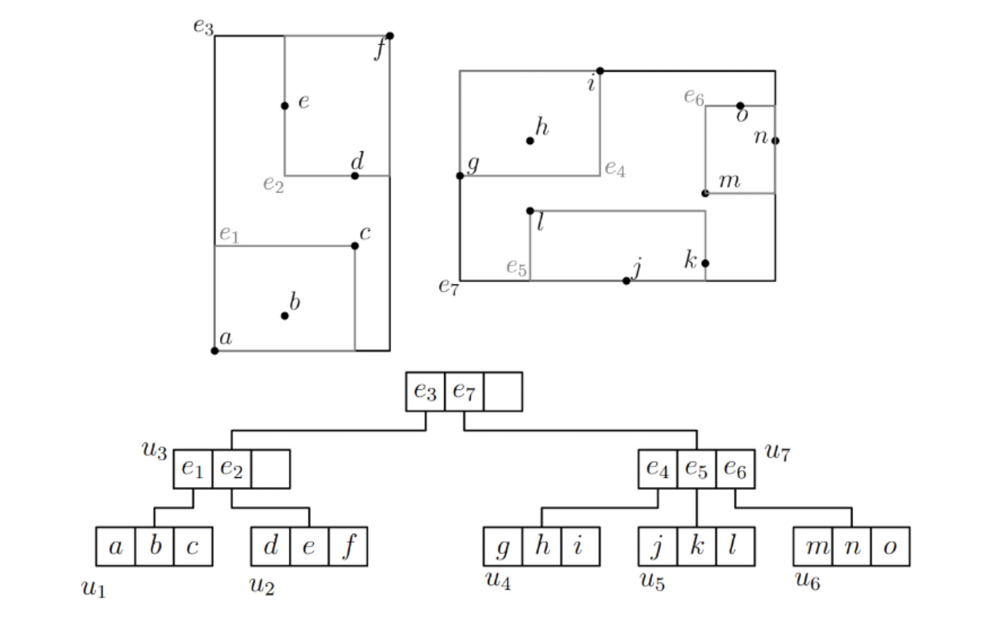

# Laboratorio 13

## Parte Dirigida

---

### Computer vision

El término Computer Vision (Visión Artificial en español) es un subcampo de machine learning que enseña a los ordenadores a ‘ver’ y entender el contenido de las imágenes digitales. Puede parecer una tarea muy simple ya que hasta un niño de tres años sabe diferenciar objetos tanto en imágenes como en videos. Sin embargo, a nivel biológico y computacional las cosas se complican bastante.

Es un hecho que las aplicaciones de Computer Vision (CV) al mundo real son innumerables. Además, las grandes empresas como Amazon, Google, Microsoft y Facebook están invirtiendo millones de euros en esta tecnología. Realizando una búsqueda en internet, llegamos a la conclusión de que muchos de los siguientes sectores están echando mano de la tecnología CV:

- Automoción
- Retail y Seguridad
- Salud
- Banca

### Face Recognition

La librería `face_recognition` de Python utiliza OpenCV para obtener un `vector característico` a partir de una imágen de una cara. Es decir, recibe como input una foto y devuelve un arreglo de 128 dimensiones conteniendo información sobre la cara.

### Rtree

El R-Tree, o también llamado Rectangle Tree, es una estructura de datos bastante similar a los árboles B, con la diferencia que son usados para métodos de acceso espacial, es decir, para indexar información con múltiples dimensiones. Esto se logra usando una estructura jerárquica en forma de árbol usando la estrategia MBR de dichas regiones.

### MBR

MBR (Minimum bounding rectangle) o Rectángulo delimitador mínimo nos permite manejar objetos geómetricos complejos, definiendo una región rectangular lo más pequeña posible para poder envolver estos objetos en su totalidad. Esto nos permite:

- Buscar todas las regiones que están contenidas dentro de otra región
- Buscar todas las regiones que se sobreponen sobre otra región dada
- Buscar todas las líneas que cruzan un determinado polígono

### Búsqueda por rango

Para encontrar algún item (rectángulo/polígono) que interseca algún punto o región, se comienza desde el nodo raíz:

- Si el nodo raíz es un nodo hoja, retornar aquellos ítems cuyas claves
  intersecan el punto o región de entrada.
- Sino, buscar recursivamente comenzando por cada hijo del nodo
  actual cuyo bounding box interseca el punto o región de entrada.

Para las búsquedas por rango, se contará con un párametro `r`, el cuál sera un radio en el cual se buscaran todos los puntos que intersecan tal radio dado un punto de partida

### K vecinos más cercanos (KNN)

Es un tipo de búsqueda en la cuál se buscan los K elementos del árbol más próximos a un punto de partida

## Parte Dirigida

---

Para este laboratorio, se utilizara la siguiente [página](http://ec2-3-128-171-175.us-east-2.compute.amazonaws.com:5001/) la cual contiene una base de datos con más de 12 mil imágenes indexadas en un RTree.

### Ejercicio 1:

Realice una búsqueda por rango (con párametro 2), usando como input una imagen suya

### Ejercicio 2:

Realice una búsqueda de los k vecinos mas cercanos (siendo k el último digito de tu código), usando como input una imagen suyo

### Ejercicio 3:

Realice una búsqueda por rango (con párametro 2), usando como input la imagen del "famoso" de su preferencia

### Ejercicio 4:

Realice una búsqueda de los k vecinos más cercanos (siendo k el último dígito de su código), usando como input la imagen del "famoso" de su preferencia

---

### Entregable

Subir 4 imágenes de tipo (.jpg, .jpeg o .png) evidenciando el resultado de cada consulta. Ejemplo: `1.png`

---

### Source Code

Si por curiosidad desean revisar el código fuente o ejecutarlo ustedes mismos (necesitan un sistema operativo Debian), pueden encontrar el código en [Github](https://github.com/vostolaza/face-recognition).
