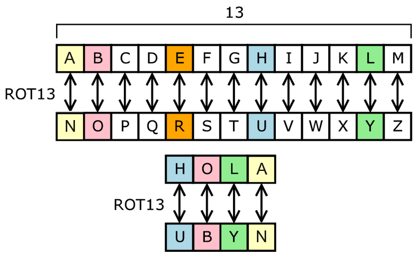

# Laboratorio 14

## Parte Dirigida

La criptografía es el desarrollo de un conjunto de técnicas que permiten alterar y modificar mensajes o archivos con el objetivo de que no puedan ser leídos por todos aquellos usuarios que no estén autorizados a hacerlo. Hoy en día, en pleno auge de las comunicaciones digitales, funciona como la base para cualquier proceso de seguridad informática.

---

### Criptografía

La criptografía es la disciplina que se encarga de que el intercambio de información y de datos se produzca de forma segura. Se centra en el desarrollo de sistemas basados en algoritmos que aumentan su complejidad a medida que la tecnología avanza.

Esta disciplina nació en la Antigua Grecia con el objetivo de evitar que se difundan secretos militares. Los mensajes se encriptaban con métodos sencillos como, por ejemplo, alternando las letras del abecedario. Un ejemplo de esto es el conocidísimo algoritmo de encriptación de Cesár.



## Parte Práctica

---

Para el laboratorio de esta semana se les pedirá desarrollar un algoritmo de desencriptación basado en el siguiente ejemplo. Se tiene el siguiente texto:

```
Bgc-bfufb tegaedppqna ql aggv zge xof tegaedppfe'l lgjb.

Xof adpf vflqanfe logjbvn'x hf pdwqna d cgebv qn coqro xof tbdkfe ql mjlx d lpdbb tdex. Xof tbdkfe QL XOF HGLL; qx'l kgje vjxk xg fnxfexdqn oqp ge ofe.

Zgrjl ql d pdxxfe gz vfrqvqna codx xoqnal kgj def ngx agqna xg vg.

Xof rglx gz dvvqna d zfdxjef qln'x mjlx xof xqpf qx xdwfl xg rgvf qx. Xof rglx dblg qnrbjvfl xof dvvqxqgn gz dn ghlxdrbf xg zjxjef fstdnlqgn. Xof xeqrw ql xg tqrw xof zfdxjefl xodx vgn'x zqaox fdro gxofe. - Mgon Rdepdrw.

(ccc.adpdljxed.rgp/uqfc/nfcl/234346?utkjpvbjr)

(ccc.hedqnkijgxf.rgp/ijgxfl/djxogel/m/mgon_rdepdrw.oxpb)
```
Si se sabe que solo se han encriptado las letras del alfabeto (a - z).

Para ello ordena las letras del mensaje encriptado de acuerdo al numero de veces que se repiten (de mayor a menor) y compáralo con la tabla de frecuencia de caracteres del lenguaje en que esta escrito este mensaje, que para este caso es:

`freqLang = "TEOAISRHNUCMDLGWFPYKJBVQX"` (de mas frecuente a menos frecuente)

Uttilizando la tabla de frecuencia `freqLang`, podemos obtener el texto desencriptado:

```
Low-level programming is good for the programmer's soul.

The game designer shouldn't be making a world in which the player is just a small part. The player IS THE BOSS; it's your duty to entertain him or her.

Focus is a matter of deciding what things you are not going to do.

The cost of adding a feature isn't just the time it takes to code it. The cost also includes the addition of an obstacle to future expansion. The trick is to pick the features that don't fight each other. - John Carmack.

(www.gamasutra.com/view/news/234346?vpyumdluc)

(www.brainyquote.com/quotes/authors/j/john_carmack.html)
```

---

Implementar la función: `decryptMessage( message, freqLang )`

Tu programa debe imprimir el texto desencriptado en pantalla.

Mantener las mayúsculas y minúsculas del mensaje, así como los saltos de linea.

El texto a desencriptar y la frecuencia de caracteres dependerá del último dígito de tu código de alumno:

- `0-1`: 
```py
text="Tfwv wv tfs hwzvt xubzvs wy tfs vspbsyxs uh wytzuebxtuzj xubzvsv tu Xugcbtsz Vxwsyxs.Tfwv xubzvs wv wytsyese tu xuosz tfs xuyxsctv ubtdwyse kj tfs Xugcbtwyi Xbzzwxbda WSSS-XV/AXG 2013.\nCzuizaggwyi wv uys uh tfs cwddazv uh Xugcbtsz Vxwsyxs; ayj czuhsvvwuyad uh tfs azsa, nwdd ysse tu czuizag tu gatszwadwms tfswz guesdv aye czucuvadv. Tfwv xubzvs wytzuebxsv caztwxwcaytv tu tfs hbyeagsytad xuyxsctv uh tfwv azt.\nTucwxv wyxdbes eata tjcsv, xuytzud vtzbxtbzsv, hbyxtwuyv, dwvtv, zsxbzvwuy, aye tfs gsxfaywxv uh slsxbtwuy, tsvtwyi, aye eskbiiwyi."

freqLang="ETOSICNRAUPLDHMFGYBXZWVQ"
```
- `2-3`: 
```py
text="Pegifcac gafjiajfcg kfbrepc anc ancbfcaeidm lbjhpdaebhg hcicggdfq lbf ibokjadaebh. Ancgc ljhpdochadmg dfc hba bhmq jgcljm ab pcrcmbk ibokjadaebh lfbo d ancbfcaeidm kbeha bl recu dg ea ndkkchg eh anc ibjfgc bl ibokjadaebhdm ancbfq, tja dmgb eg jgcljm lbf anc kfdiaeic bl ibokjaehs; Eh kdfaeijmdf eh dkkmeidaebhg gjin dg rcfeleidaebh, ifqkabsfdknq, lbfodm ocanbpg, cai."

freqLang="TOEAIRSNCUPFLHMDYVGBW"
```

`4-5`:
```py
text="Zida da ziy aycbgj cbfeay dg ziy aysfygcy bl dgzebjfczber cbfeaya dg cbonfzye\nacdygcy. Ziy cbfeay pdmm dgzebjfcy azfjygza dg ziy qhedbfa zbndca bl ziy heyh bl cbonfzdgk afci ha: Hmkbedzioa, Jhzh Azefczfeya, Ablzphey Ygkdgyyedgk, yzc."

freqLang="ETSOCIRUNAHDGFLPMWVYQ"
```
`6-7`:
```py
text="Gkc pfmnj kdi lkdhtcj jrc gf gkc ric fw wdqmel dhj mcndgcj gclkhfnfteci, mdoej, geucnv dhj ocmifhdnezcj dllcii gf gkc ehwfmudgefh, gkmfrtk pcq gclkhfnftv, rqexregfri dhj ocmsdiesc; gkcv kdsc lkdhtcj gkc pdv pc jf gkehti, kfp jf pc gkehy? dhj kfp jfci gkc ehjrigmv jcscnfo? Pcq gclkhfnfteci, rqexregfri dhj ocmsdiesc dmc qdicj fh gkc jcscnfouchg fw pcq icmselci, pcq dooneldgefhi dhj ufqenc dooneldgefhi, pkelk dmc hclciidmv gf rhjcmigdhj gkc dmlkegclgrmc, jcieth, dhj euoncuchgdgefh fw pcq icmselci, pcq dooneldgefhi dhj ufqenc dooneldgefhi."

freqLang="EAIOTNSDHCRLPWBUVGMYFQKZ"
```
`8-9`:
```py
text="Yakbcixzyba ixaxmwiwaz (YI) hexod x ixtbc cbew ya xeibdz xee xcwxd sjwcw gbihlzwcd xcw ldwf. Zjyd xcwx yagelfwd zjw gxhzlcw, fymyzyrxzyba, cwhcwdwazxzyba, bcmxayrxzyba, zcxadkbcixzyba xaf hcwdwazxzyba bk yakbcixzyba; Xembcyzjid zb yihcbpw zjw wkkygywago xaf wkkwgzypwawdd bk xggwddyam xaf lhfxzyam dzbcwf yakbcixzyba, fxzx ibfweyam xaf xndzcxgzyba, xaf hjodygxe kyew dzbcxmw zwgjayqlwd.Yz xedb gbpwcd yakbcixzyba dwglcyzo, hcypxgo, yazwmcyzo xaf hcbzwgzyba ya x djxcwf wapycbaiwaz.\nDzlfwazd awwf zb nw xnew zb fwpwebh gbagwhzlxe xaf hjodygxe fxzx ibfwed, fwzwciyaw sjygj (YI) iwzjbfd xaf zwgjayqlwd xcw xhhcbhcyxzw kbc x mypwa hcbnewi, xaf nw xnew zb dwewgz xaf yihewiwaz xa xhhcbhcyxzw YI dbelzyba zjxz cwkewgzd xee xhheygxnew cwdzcygzybad, yagelfyam Dgxexnyeyzo xaf ldxnyeyzo."

freqLang="EAITNORSLDCPMHFUGBYVQZWJ"
```


---

### Entregable

Un archivo `.py` con la resolución del problema y un archivo `.txt` con el mensaje desencriptado.

---

