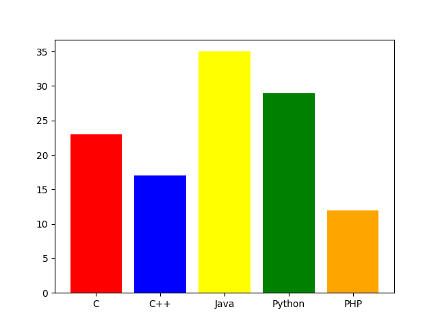
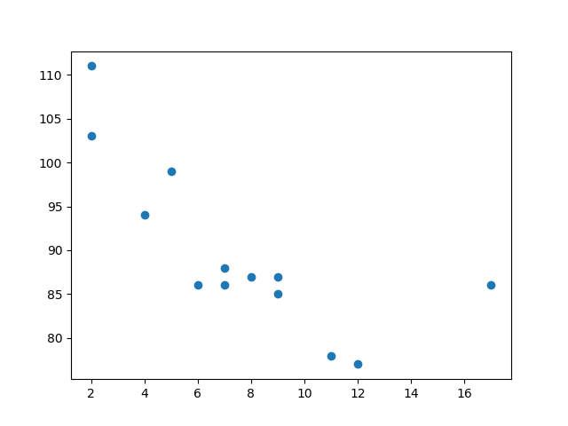
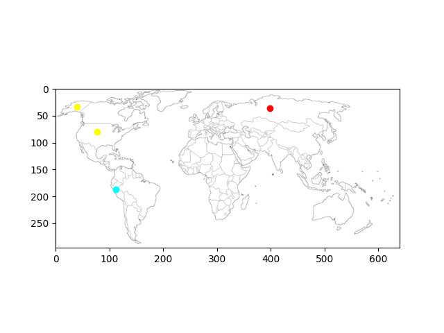

# Laboratorio 9
## Parte Dirigida
---

La visualización de datos es la representación gráfica de información y datos. Al utilizar elementos visuales como cuadros, gráficos y mapas, las herramientas de visualización de datos proporcionan una manera accesible de ver y comprender tendencias, valores atípicos y patrones en los datos.

La visualización de datos es otra forma de arte visual que capta nuestro interés y mantiene nuestros ojos en el mensaje. . Si podemos ver algo, lo interiorizamos rápidamente. Es contar historias con un propósito. Si alguna vez haz visto una gigantesca hoja de cálculo de datos y no te fue posible ver una tendencia, sabes cuán eficaz puede ser una visualización

### Leer un JSON como un diccionario:
---
```py
import json

f = open('<filename>.json')
d = json.load(f)
```


### Visualizar datos:
---
Para este laboratorio, vamos a utilizar la librería `matplotib`.

```py
import matplotlib.pyplot as plt
```

#### Instalación

```sh
pip install matplotlib
```

### Gráfico de barras
```py
plt.bar(<keys>, <values>)
plt.show()
```
Dónde `keys` y `values` son listas de igual longitud. Adicionalmente, se puede pasar el argumento `color` con una lista para poder escoger el color de cada barra.

### Scatterplot

```py
plt.scatter(<valores x>, <valores y>)
plt.show()
```
Dónde los valores del eje `x` y `y` son listas de igual longitud. Como tercer parámetro se pueden ingresar distintos símbolos para representar la información como `*` para estrellas `o` para puntos o `x` para cruces.

Adicionalmente, se tiene el método `legend` el cual recibe una lista titulos para la leyenda y los métodos `xlabel` y `ylabel` para darles etiquetas a los ejes `x` e `y`.
```py
plt.legend(<titulos>)
plt.xlabel(<nombre>)
plt.ylabel(<nombre>)
```

### Graficar sobre un mapa

Si se tiene un mapa como imagen de fondo, podemos graficar sobre este, utlizando los ejes `x` e `y` como coordenadas.

```py
im = plt.imread('imagen.png')
implot = plt.imshow(im)
```


## Ejemplo:

### Gráfico de Barras

```py
import matplotlib.pyplot as plt

langs = ['C','C++','Java','Python','PHP']
students = [23,17,35,29,12]
colors = ['red', 'blue', 'yellow', 'green', 'orange']
plt.bar(langs, students, color=colors)
plt.show()
```



### Scatterplot

```py
import matplotlib.pyplot as plt

x = [5,7,8,7,2,17,2,9,4,11,12,9,6]
y = [99,86,87,88,111,86,103,87,94,78,77,85,86]

plt.scatter(x, y)
plt.show()
```

}

### Graficar sobre un mapa

```py
import matplotlib.pyplot as plt

im = plt.imread('b.png')
plt.imshow(im)

plt.plot([112], [187], 'o', color="cyan")
plt.plot([77, 40], [80, 33], 'o', color="yellow")
plt.plot([398], [36], 'o', color="red")

plt.show()
```

}

## Parte Práctica

El entrenador Paolo sigue con su deseo de convertirse en un maestro Pokémon y le fue de gran ayuda la información que le brindaste la vez pasada, sin embargo, necesita conocer aún mucho más sobre los Pokémon y la información acerca de estos contenida en la base de datos no es muy amigable ni intuitiva para el, por lo que necesitará ver la información de manera visual para entenderla y comprenderla de mejor manera. Ayuda a Paolo y resuelve los siguientes ejericios:

### Ejercicio 1

Mostrar un `gráfico de barras` que muestre el número total de Pokémon por cada tipo elemental. Usar la función `getTypesByName` para obtener información acerca de los tipos de cada Pokémon. Asignarle un color a cada barra correspondiente a cada tipo.

TIP: Usar el siguiente link (https://matplotlib.org/stable/gallery/color/named_colors.html) para ver información acerca de los colores en `matplotlib`

### Ejercicio 2

Mostrar un `scatterplot` que muestre el número de debilidades de los Pokémon inciales (primeros 9 Pokémon de la Pokédex). Usar la función `getWeaknessesByName` para obtener información de las debilidades de cada pokémon.

### Ejercicio 3

Mostrar las ubicaciones en el `mapa` de Kanto de las tres aves legendarias (Articuno, Zapdos y Moltres). Las coordenadas de cada Pokémon las pueden obtener con la función `getLocationsByName` y la imagen del mapa de Kanto en el archivo `Kanto.png`. Los puntos para cada ave tienen que ser de color celeste, amarillo y rojo respectivamente.

### Ejercicio 4

Mostrar las ubicaciones en el `mapa` de Kanto del Pokémon Magikarp. Las coordenadas de cada Pokémon las pueden obtener con la función `getLocationsByName` y la imagen del mapa de Kanto en el archivo `Kanto.png`. Los puntos tienen que ser de color verde.

NOTA: Poner títulos y etiquetas a los ejes para cada gráfico

### Entregable

Debe entregar un archivo `.py` con la solucion a cada ejercicio en una funcion `ejercicioX` (X siendo el número del ejercicio).
